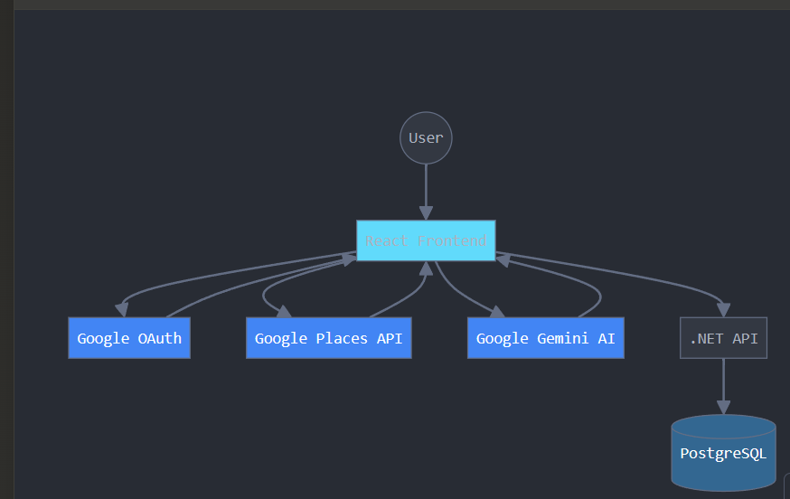
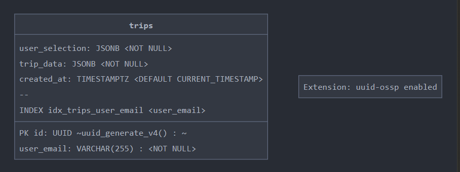

INSTALL PACKAGE COMMANDS

dotnet add package Microsoft.AspNetCore.OpenApi --version 9.0.0
dotnet add package Microsoft.EntityFrameworkCore.Design --version 9.0.0
dotnet add package Npgsql.EntityFrameworkCore.PostgreSQL --version 9.0.2
dotnet add package Swashbuckle.AspNetCore --version 7.2.0

THEN

dotnet run

SQL SCHEMA

